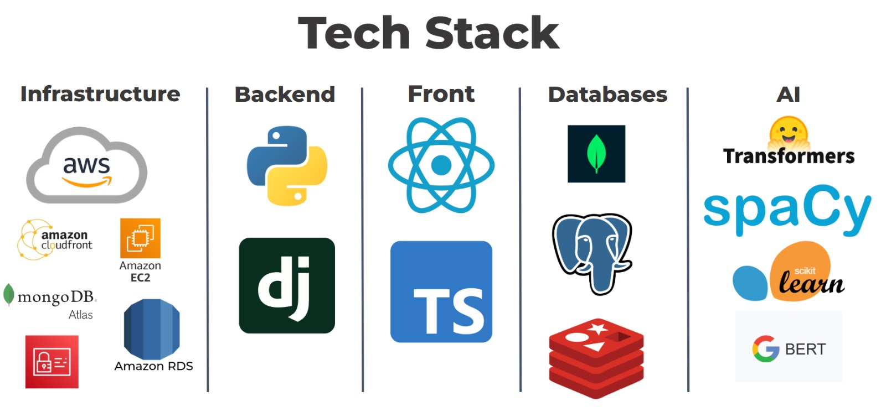

# 🌐 Financial Intelligence Hub – Backend  
*A centralized platform for smarter, data-driven financial decisions.*

This project is a **Backend API** that powers a financial analytics platform designed to centralize market information and help users make informed investment decisions.  
It exposes structured endpoints that aggregate financial news through web scraping, process market data for stocks, ETFs, and currencies, compute technical indicators, recommend daily trading opportunities, and provide a multilingual AI chatbot capable of answering questions about both the platform and the financial world.

---

## 🚀 Key Features

- **Financial News Aggregation** from multiple sources using web scraping.  
- **Market Charts & Indicators** for stocks, ETFs, and forex — all market data sourced from **Yahoo Finance** (price history, RSI, MA, volatility, etc.).  
- **Trade of the Day Engine** recommending the strongest opportunities of the day based on RSI-driven analysis, enriched with insights from a **third-party financial analysis provider**.  
- **AI Chatbot (EN/ES)** trained with NLP/ML models to answer financial and platform-related questions.  
- **Centralized API** with MVC Architecture serving all data to the React frontend.  
---
## 🔗 Live Demo & Frontend Repo

- 🌐 **Live Web App:** https://d3iqcabelr1yf0.cloudfront.net/app/market  
- 👤 **Demo User:** demo@example.com  
- 🔑 **Password:** demo123456  
- 📦 **Frontend Repository:**  
  https://github.com/SebastianGranadosJ/financial-intelligence-hub-front
---

---

## 📰 News Aggregation & Sentiment Analysis Module

This module centralizes financial news from multiple sources to give users a concise, sentiment-aware overview of the market. Each news entry includes:

- **Title**
- **Description**
- **Publication date**
- **Source**
- **Original link**
- **Sentiment score** (positive/negative + intensity)

### 🔍 How It Works

#### **1. Targeted News Discovery**
The system builds a pool of news URLs using **Google News queries** generated from:
- A predefined list of **financial topics**
- A predefined set of **seed sources**

Each query produces a Google News results page, which becomes the input for scraping.

#### **2. Web Scraping Pipeline**
For every Google News results page, the scraper extracts key elements using Google’s specific selectors:

| Element        | CSS Selector      |
|----------------|-------------------|
| **Title**      | `div.n0jPhd`      |
| **URL**        | `a.WlydOe`        |
| **Description**| `div.GI74Re`      |
| **Date**       | `div.rbYSKb`      |
| **Source**     | `div.NUnG9d`      |

The scraper normalizes the extracted data and prepares it for NLP processing.

#### **3. Sentiment Analysis Using DistilBERT**
Each article description is analyzed using a **DistilBERT** model from Hugging Face Transformers.

**Why DistilBERT?**
- ~97% of BERT’s accuracy  
- ~40% fewer parameters  
- Significantly faster inference (ideal for large scraping batches)

The model returns a **sentiment label** (positive/negative) and a **confidence score**.

#### **4. Smart Storage & Duplicate Prevention**
All processed news items are stored in **MongoDB** along with their sentiment and scrape metadata.  
Before saving, the system filters out articles already scraped or older than the last session, ensuring efficient crawling with no duplicates.

