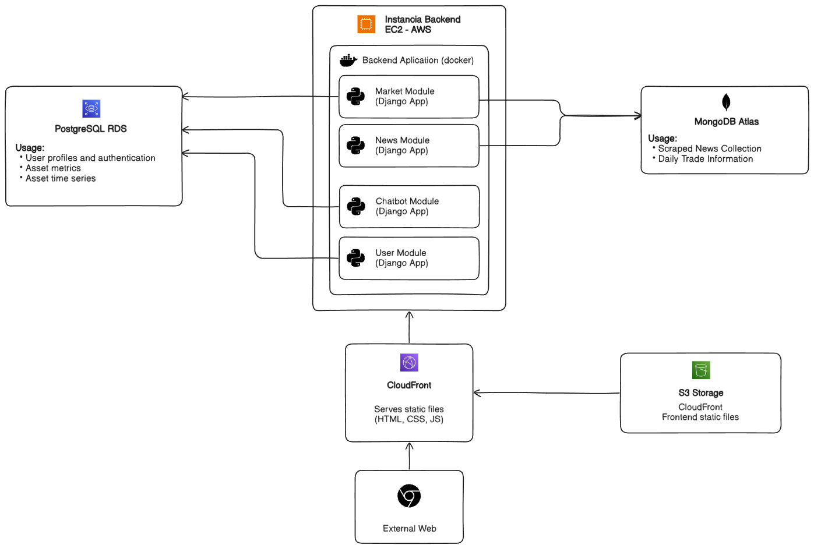

# 🌐 Financial Intelligence Hub – Backend  
*A centralized platform for smarter, data-driven financial decisions.*

This project is a **Backend API** that powers a financial analytics platform designed to centralize market information and help users make informed investment decisions.  
It exposes structured endpoints that aggregate financial news through web scraping, process market data for stocks, ETFs, and currencies, compute technical indicators, recommend daily trading opportunities, and provide a multilingual AI chatbot capable of answering questions about both the platform and the financial world.

---

## 🚀 Key Features

- **Financial News Aggregation** from multiple sources using web scraping.  
- **Market Charts & Indicators** for stocks, ETFs, and forex — all market data sourced from **Yahoo Finance** (price history, RSI, MA, volatility, etc.).  
- **Trade of the Day Engine** recommending the strongest opportunities of the day based on RSI-driven analysis, enriched with insights from a **third-party financial analysis provider**.  
- **AI Chatbot (EN/ES)** trained with NLP/ML models to answer financial and platform-related questions.  
- **Centralized API** with MVC Architecture serving all data to the React frontend.  
---
## 🔗 Live Demo & Frontend Repo

- 🌐 **Live Web App:** https://d3iqcabelr1yf0.cloudfront.net/app/market  
- 👤 **Demo User:** demo@example.com  
- 🔑 **Password:** demo123456  
- 📦 **Frontend Repository:**  
  https://github.com/SebastianGranadosJ/financial-intelligence-hub-front
---

---
## Infrastructure Diagram

---

## 📰 Financial News Module

This module centralizes financial news from multiple sources to give users a concise, sentiment-aware overview of the market. Each news entry includes:

- **Title**
- **Description**
- **Publication date**
- **Source**
- **Original link**
- **Sentiment score** (positive/negative + intensity)

### 🔍 How It Works

#### **1. Targeted News Discovery**
The system builds a pool of news URLs using **Google News queries** generated from:
- A predefined list of **financial topics**
- A predefined set of **seed sources**

Each query produces a Google News results page, which becomes the input for scraping.

#### **2. Web Scraping Pipeline**
For every Google News results page, the scraper extracts key elements using Google’s specific selectors:

| Element        | CSS Selector      |
|----------------|-------------------|
| **Title**      | `div.n0jPhd`      |
| **URL**        | `a.WlydOe`        |
| **Description**| `div.GI74Re`      |
| **Date**       | `div.rbYSKb`      |
| **Source**     | `div.NUnG9d`      |

The scraper normalizes the extracted data and prepares it for NLP processing.

#### **3. Sentiment Analysis Using DistilBERT**
Each article description is analyzed using a **DistilBERT** model from Hugging Face Transformers.

**Why DistilBERT?**
- ~97% of BERT’s accuracy  
- ~40% fewer parameters  
- Significantly faster inference (ideal for large scraping batches)

The model returns a **sentiment label** (positive/negative) and a **confidence score**.

#### **4. Smart Storage & Duplicate Prevention**
All processed news items are stored in **MongoDB** along with their sentiment and scrape metadata.  
Before saving, the system filters out articles already scraped or older than the last session, ensuring efficient crawling with no duplicates.

## 📈 Financial Market Module

This module provides **price charts, metrics, and technical indicators** for Stocks, ETFs, and Forex, enabling users to analyze trends and make informed decisions.

### 🔹 Asset Pools

**Stocks:**  
- S&P 500 constituents  

**ETFs:** 15 key ETFs representing indices, sectors, commodities, and strategies:

- SPY – S&P 500 ETF  
- VOO – Vanguard S&P 500 ETF  
- QQQ – Nasdaq 100 ETF  
- DIA – Dow Jones Industrial Average ETF  
- IWM – Russell 2000 ETF  
- EFA – MSCI EAFE ETF  
- EEM – Emerging Markets ETF  
- XLF – Financials Select Sector ETF  
- XLK – Technology Select Sector ETF  
- XLE – Energy Select Sector ETF  
- XLV – Health Care Select Sector ETF  
- GLD – Gold ETF  
- SLV – Silver ETF  
- ARKK – ARK Innovation ETF  
- VTI – Vanguard Total Stock Market ETF  

**Forex:** 10 highly liquid major and popular cross pairs covering ~95% of global volume:

- **Majors:** EUR/USD, USD/JPY, GBP/USD, USD/CHF, AUD/USD, USD/CAD, NZD/USD  
- **Crosses:** EUR/GBP, EUR/JPY, GBP/JPY  

---

### 🔹 Data Storage & Updates

- **Metrics:** fetched from Yahoo Finance and updated several times daily (no historical storage).  
- **Time Series:** stored historically at **daily granularity** in PostgreSQL; last 5 years of data preloaded via script.  

**Query Behavior:**  
- **1 Month / 1 Year / 5 Years:** data retrieved from PostgreSQL  
- **1 Day / 5 Days:** data fetched directly from Yahoo Finance via a **Facade pattern** for clean abstraction and API consistency  

---

### 🔹 Features

- Visualize historical **price charts** for all assets.  
- Access key **metrics and technical indicators** for informed decision-making.  
- Optimized for **fast updates** on short-term queries while preserving historical context for long-term analysis.  

